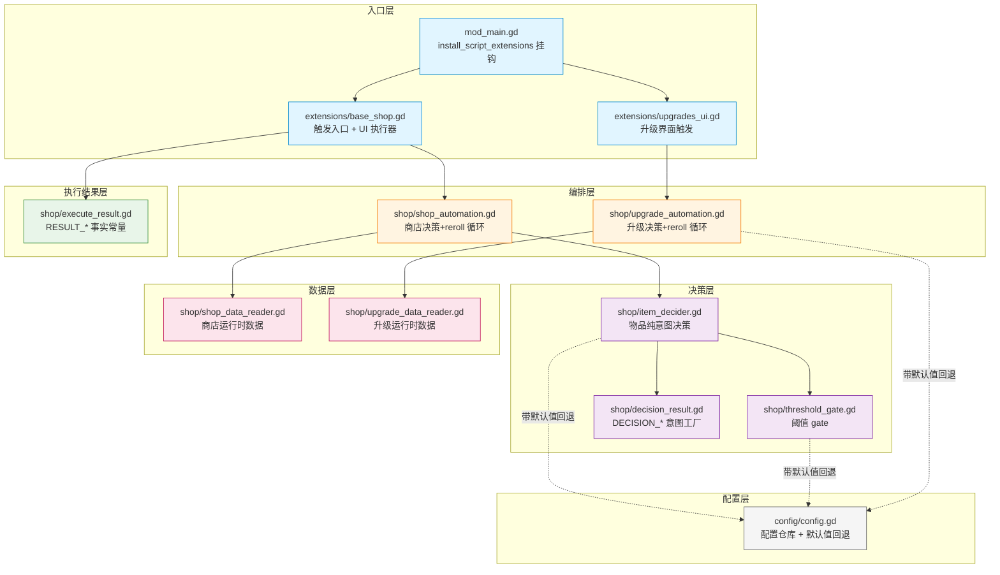
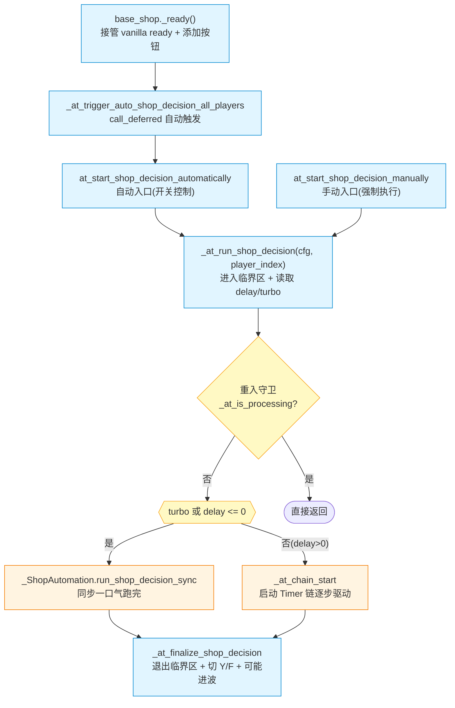
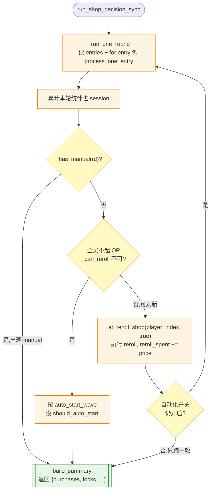
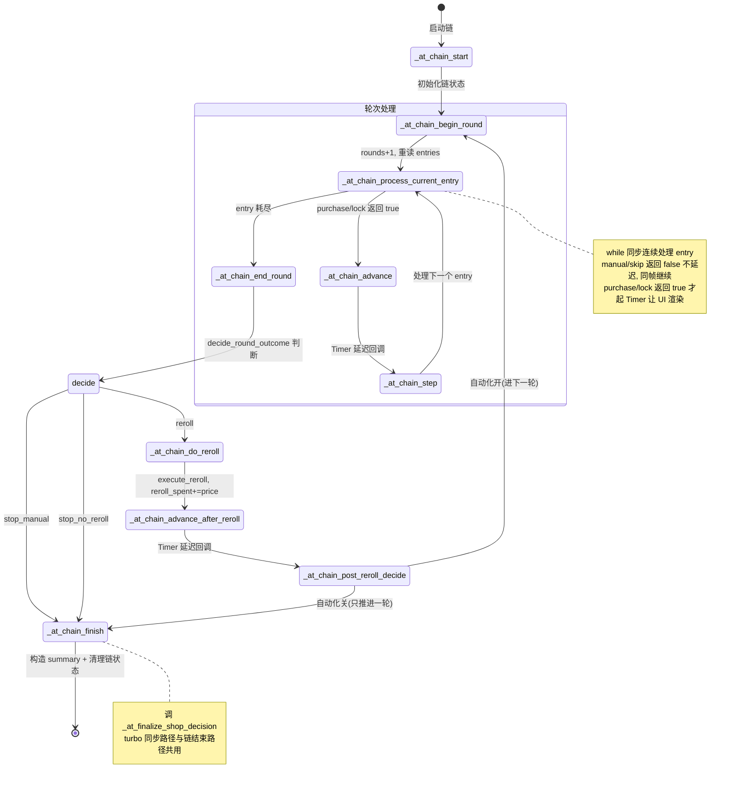
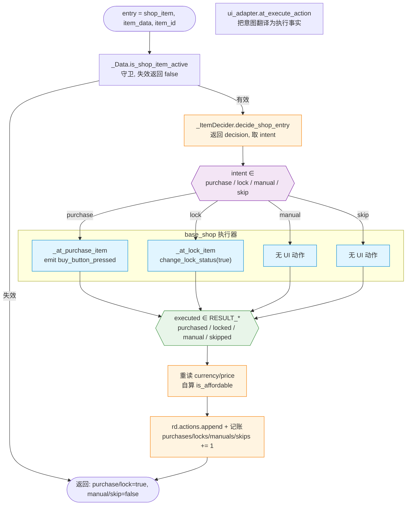
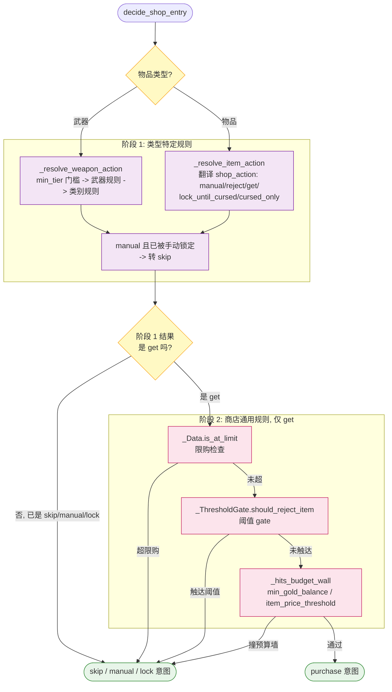
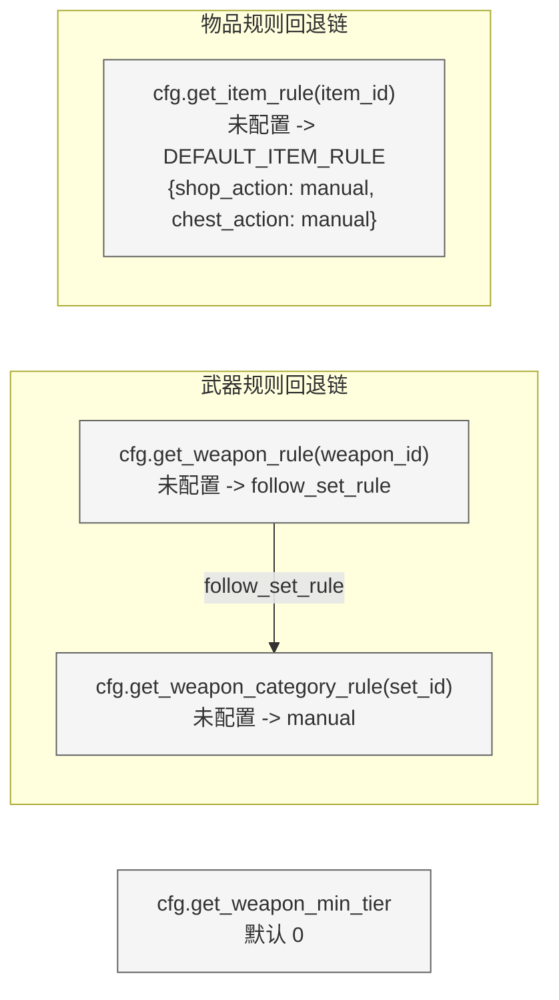
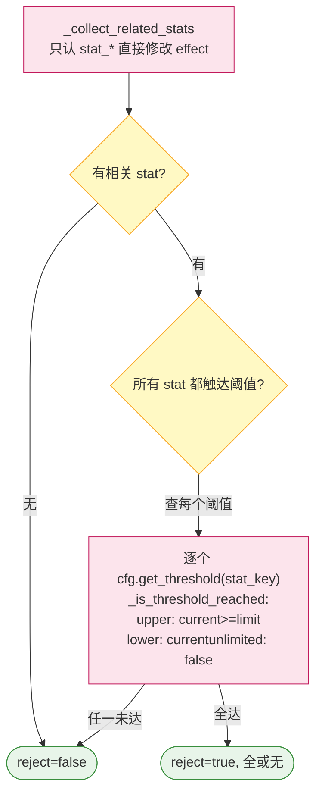
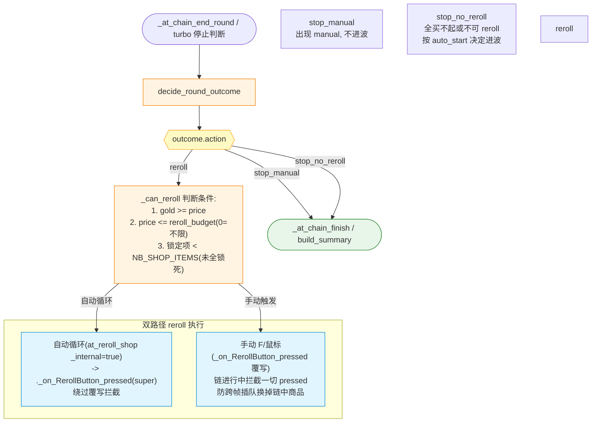
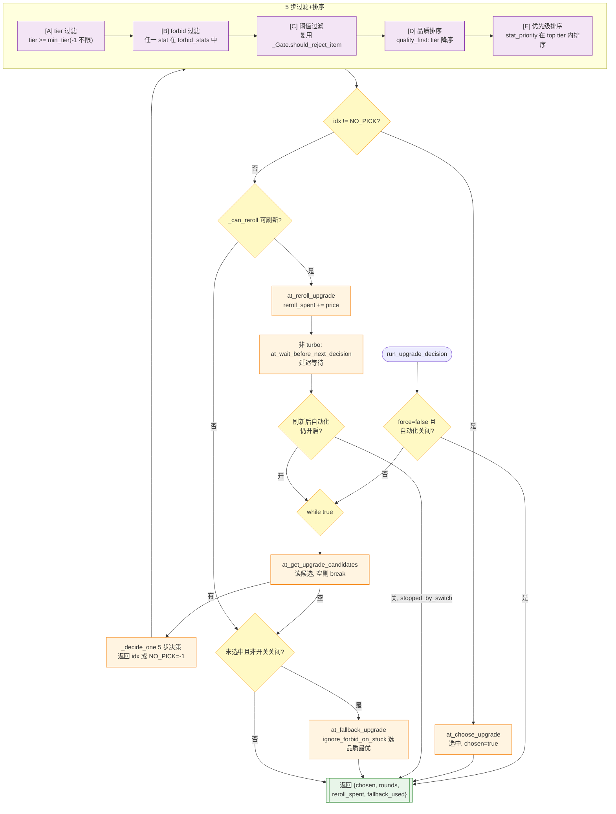

# AutoTato 商店决策链路

> 本文档用 Mermaid 图表直观展示 `fengyifan-AutoTato` 商店决策的完整调用链路,
> 涵盖商店物品决策线与升级决策线,以及 turbo / 非 turbo 两种执行模式。
> 适合作为开发者的架构教学与查阅材料。

---

## 一、分层架构总览

| 层 | 文件 | 职责 |
|---|---|---|
| **入口层** | `mod_main.gd` / `extensions/base_shop.gd` / `extensions/upgrades_ui.gd` | mod 安装、Script Extension 挂钩、UI 触发入口、UI 动作执行（购买/锁定/reroll/进波） |
| **编排层** | `shop/shop_automation.gd` / `shop/upgrade_automation.gd` | 流程编排:决策 + 执行 + reroll 循环 + 停止条件判断 |
| **决策层** | `shop/item_decider.gd` / `shop/threshold_gate.gd` / `shop/decision_result.gd` | 单物品纯决策意图(purchase/lock/manual/skip),不执行 UI |
| **执行结果层** | `shop/execute_result.gd` | 执行事实常量(purchased/locked/manual/skipped) |
| **数据层** | `shop/shop_data_reader.gd` / `shop/upgrade_data_reader.gd` | 集中读取 vanilla 运行时数据(金币/价格/物品节点/阈值/限购) |
| **配置层** | `config/config.gd` | 配置仓库,统一负责默认值回退,外部拿到的永远是最终可用值 |

`★ 核心数据流`:配置层调用统一用虚线,表示"带默认值回退"--外部永远拿到最终可用值,不做 `if null` 判断。

---

## 二、商店决策主流程(turbo / 非 turbo 分叉)

入口层 `base_shop.gd` 的关键方法:

- **`_ready()`**:接管 vanilla 商店场景 ready,添加 AutoTato 决策按钮,`call_deferred` 自动触发一轮决策,开启临界区轮询。
- **`at_start_shop_decision_automatically(player_index)`**:自动入口,进入商店/reroll 后调用,受 `is_shop_automation_enabled()` 开关控制。
- **`at_start_shop_decision_manually(player_index)`**:手动入口,点击决策按钮或按 F 时调用,即使自动化关闭也强制执行一轮。
- **`_at_run_shop_decision(cfg, player_index)`**:执行单次决策 session,**turbo 与非 turbo 的分叉点**。

---

## 三、turbo 同步路径

编排层 `shop_automation.gd` 的 turbo 急速路径,用 `while+for` 嵌套循环一口气跑完,无延迟。

- **`run_shop_decision_sync(ui_adapter, player_index) -> Dictionary`**:turbo 同步入口,返回 summary 字典。
- **`_run_one_round(ui_adapter, player_index) -> Dictionary`**:运行一轮,`for entry` 逐个调 `process_one_entry`。
- **`_has_manual(rd)` / `_all_unpurchased_insufficient(rd)`**:停止条件判断。
- **`_can_reroll(ui_adapter, player_index, reroll_spent) -> Dictionary`**:客观能否 reroll。

---

## 四、非 turbo Timer 链状态机

非 turbo 模式把同步 `while+for` 循环展开为 Timer 链状态机。链状态全在 base_shop 的 `_at_chain_*` 字段里,Timer 默认 `PAUSE_MODE_STOP`,ESC 暂停即冻结。

**链状态字段**:`_at_chain_active` / `_at_chain_player_index` / `_at_chain_cfg` / `_at_chain_timer` / `_at_chain_entries` / `_at_chain_entry_idx` / `_at_chain_rd` / `_at_chain_totals`。

**turbo 与非 turbo 的关键差异**:
- turbo:`run_shop_decision_sync()` 同步 `while+for` 跑完,无延迟,直接返回 summary。
- 非 turbo:Timer 链逐步驱动,每步间 `decision_step_delay` 延迟让 UI 渲染可见;链状态在 `_at_chain_*` 字段,无协程 yield 卡死风险,ESC 暂停自然冻结。

---

## 五、单 entry 决策 + 执行(两路径共用原子)

这是 turbo 与非 turbo 共用的核心原子方法。意图(DECISION_*)与事实(RESULT_*)词形刻意不同,防止混用。

- **`process_one_entry(ui_adapter, player_index, entry, rd) -> bool`**:单 entry 决策+执行+记账,返回是否需要 UI 健顿。
- **`decide_shop_entry(entry, player_index) -> Dictionary`**:纯意图决策,返回 `{intent}`。
- **`at_execute_action(intent, shop_item, player_index) -> String`**:把意图翻译为执行事实。

`★ 关键设计`:`is_affordable`(客观可执行性)不属于决策层,由 `process_one_entry` 在循环里重读自算,与决策正交--它反映前序 purchase 扣减后的最新余额,供 reroll 停止条件使用。

---

## 六、决策层两阶段判断

`decide_shop_entry` 的两阶段结构。阶段 1 是类型特定规则,阶段 2 是商店通用规则(仅对 get 生效)。

**阶段 1 配置层调用**(带默认值回退):

**阶段 2 阈值 gate**(`threshold_gate.should_reject_item`):

---

## 七、reroll 判断与执行

一轮结束后判断停止 / reroll / 进波。自动循环 reroll 与手动 reroll 走不同路径。

- **`decide_round_outcome(...) -> Dictionary`**:返回 `{action: stop_manual | stop_no_reroll | reroll, ...}`。
- **`at_reroll_shop(player_index, _internal=true)`**:自动循环内部调用,走 `.super` 绕过覆写拦截。
- **`_on_RerollButton_pressed(player_index)`(覆写)**:拦截手动 reroll,链进行中拦截一切 pressed 防跨帧插队。

---

## 八、升级决策线(独立线)

升级线是 4 选 1,结构与商店线对齐但决策逻辑内联在 `upgrade_automation.gd`,不依赖 `item_decider.gd`。

- **`run_upgrade_decision(ui_adapter, player_index, force) -> Dictionary`**:升级决策唯一入口,reroll 循环 + fallback。
- **`_decide_one(options, cfg, player_index, round_num) -> int`**:对 4 个候选做一次决策,5 步过滤+排序。

**turbo / 非 turbo 差异(升级线)**:turbo 循环内无延迟连续跑;非 turbo 每轮 reroll 后 `at_wait_before_next_decision()` 调度 `decision_step_delay` 延迟。升级线没有像商店线那样用 Timer 链状态机,而是同步循环 + 延迟等待。

---

## 九、配置层回退速查

遵循 `CLAUDE.md` 第 4 节原则:**配置默认值由 config 层返回,外部不做回退判断**。

| 方法 | 返回 | 未配置时默认值 | 用途 |
|---|---|---|---|
| `is_shop_automation_enabled()` | `bool` | `true` | 商店自动化开关 |
| `is_upgrade_automation_enabled()` | `bool` | `false` | 升级自动化开关 |
| `is_turbo_mode()` | `bool` | `false` | turbo 同步路径开关 |
| `get_general()` | `Dictionary` | 各字段独立回退 | `min_gold_balance`(0)、`item_price_threshold`(0)、`reroll_budget`(0=不限)、`auto_start_wave`(false)、`shop_respect_thresholds`(true)、`turbo_mode`(false)、`decision_step_delay`(0.3) |
| `get_item_rule(item_id)` | `Dictionary` | `DEFAULT_ITEM_RULE = {shop_action: "manual", chest_action: "manual"}` | 物品规则,非法值也回退默认 |
| `get_weapon_rule(weapon_id)` | `String` | `"follow_set_rule"` | 武器自身规则 |
| `get_weapon_category_rule(set_id)` | `String` | `"manual"` | 武器类别规则 |
| `get_weapon_min_tier()` | `int` | `0` | 武器最低 tier 门槛 |
| `get_threshold(stat_key)` | `Dictionary` | `DEFAULT_THRESHOLD = {mode: "unlimited", value: 0}` | 阈值,unlimited 不拒绝 |
| `get_upgrade_config()` | `Dictionary` | 各字段回退 | `min_tier`(-1 不限)、`quality_first`、`ignore_forbid_on_stuck`(true)、`respect_thresholds`(true) |
| `get_upgrade_forbid_stats()` | `Array` | `[]` | 升级禁止属性 |
| `get_upgrade_priority()` | `Array` | `[]` | 升级优先级 |

---

## 十、关键设计要点

`★ Insight ─────────────────────────────────────`

1. **意图与事实分离**:`decision_result.gd`(DECISION_*,决策意图)与 `execute_result.gd`(RESULT_*,执行事实)词形不同(`purchase` vs `purchased`),decider 只输出意图,执行器返回事实,编排层用事实记账。

2. **is_affordable 与决策正交**:decider 只为预算墙读 currency/price,客观可执行性 `is_affordable` 由 `shop_automation` 在循环里重读自算,供 reroll 停止条件用(反映前序 purchase 扣减后的最新余额)。

3. **配置回退收拢 config 层**:`get_item_rule` / `get_weapon_rule` / `get_threshold` 等都在内部完成完整回退链,外部直接拿最终值,不做 `if null` 判断。默认值变更只需改 config 一处。

4. **turbo 同步 vs 非 turbo Timer 链**:turbo 用 `while+for` 一口气跑完;非 turbo 用 Timer 链状态机逐步驱动,链状态在 `_at_chain_*` 字段,ESC 暂停自然冻结,无协程 yield 风险。两条路径共用 `process_one_entry` / `decide_shop_entry` / `at_execute_action` 等原子方法。

5. **reroll 拦截双路径**:自动循环 reroll 走 `at_reroll_shop` -> `.super`(绕过覆写拦截);手动 F/鼠标 reroll 走覆写的 `_on_RerollButton_pressed`(链进行中拦截一切 pressed,防跨帧插队把链中商品换掉)。

6. **升级线独立**:4 选 1,决策内联在 `upgrade_automation._decide_one`(5 步:tier/forbid/阈值/品质/优先级),无 manual 停止条件,有 fallback(`ignore_forbid_on_stuck` 选品质最优),turbo/非 turbo 差异仅在 reroll 后是否等待。
`─────────────────────────────────────────────────`
